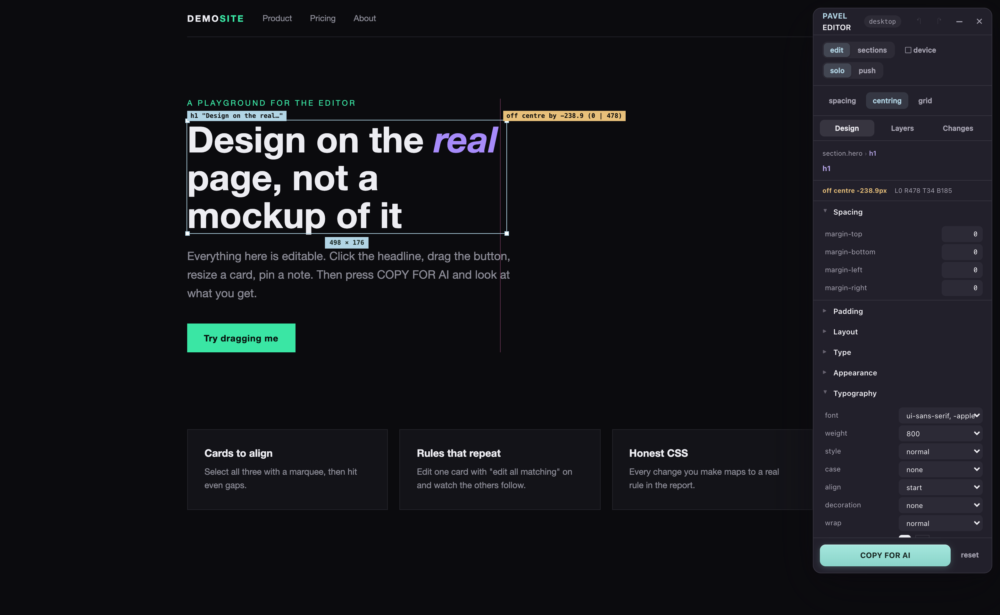
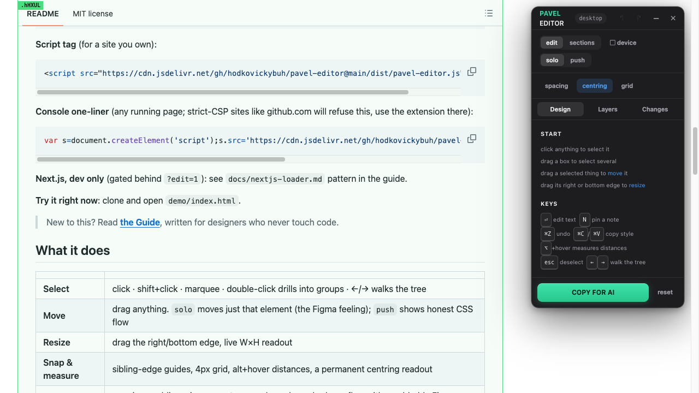
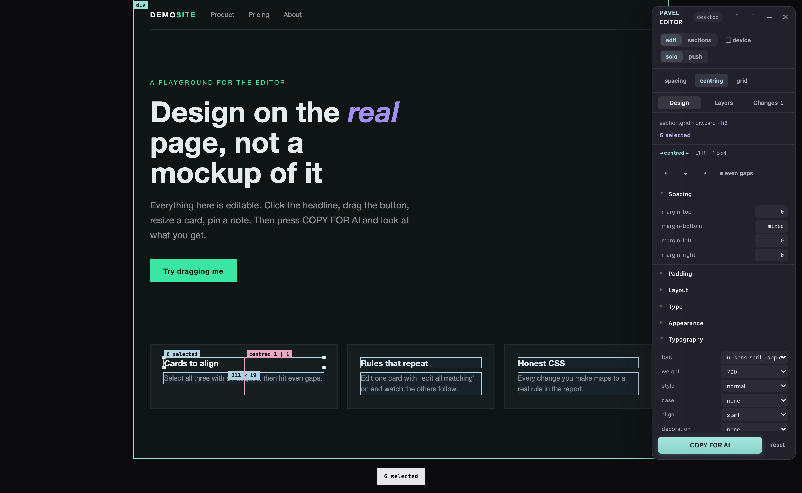
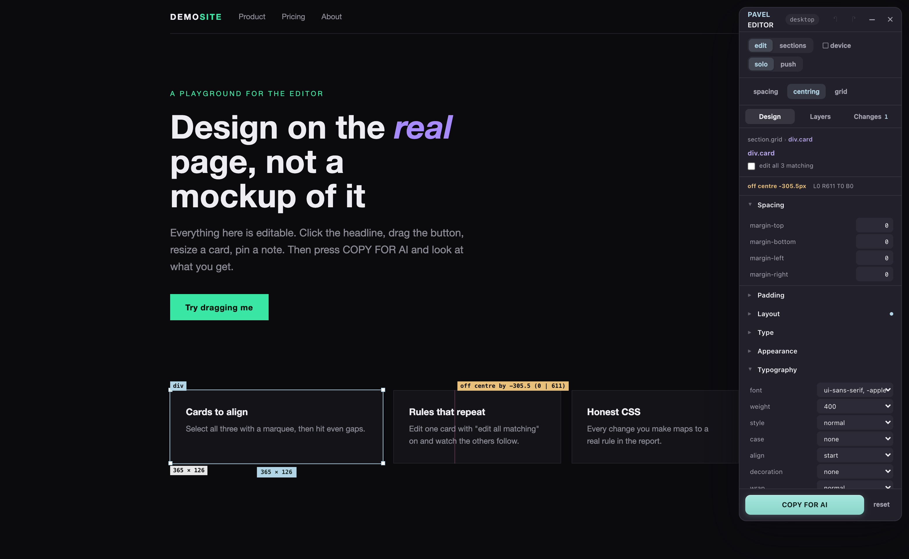
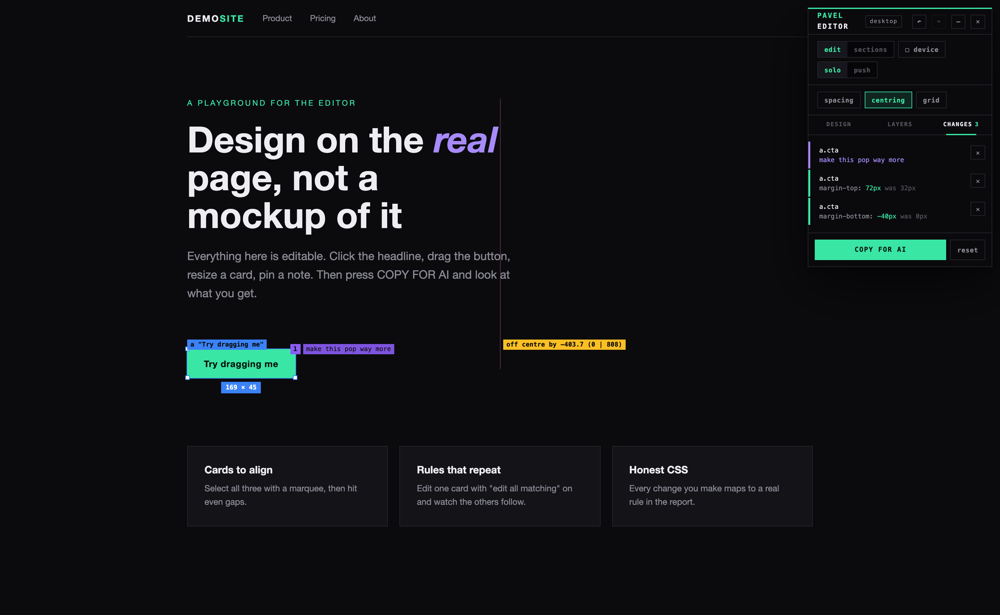
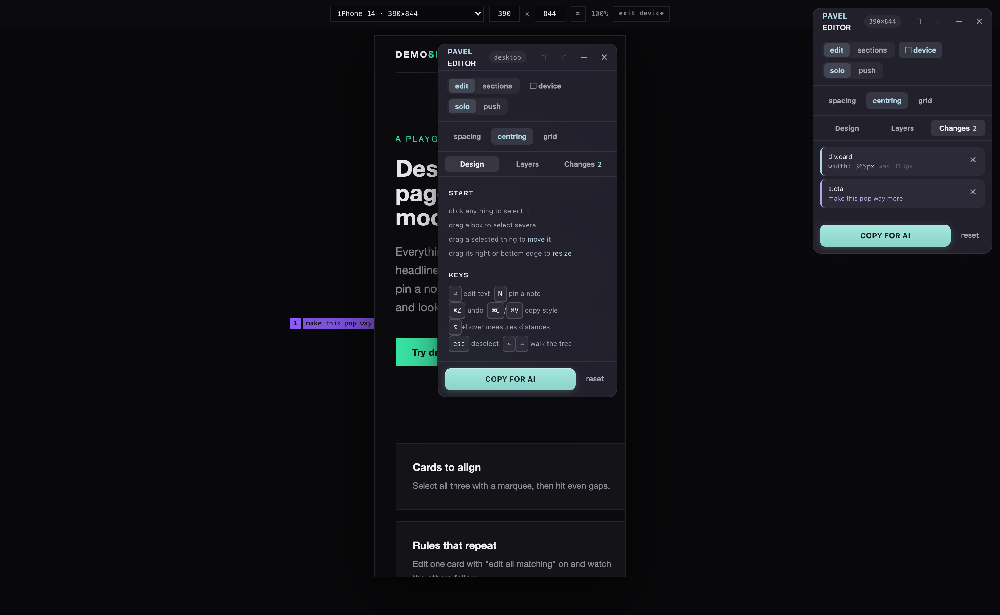

<div align="center">

# ✎ PAVEL EDITOR

**A Figma-style visual editor that runs inside any live web page.**

Click things. Drag them. Restyle them. Preview on any device. Pin notes.
Then press one button and hand the whole session to your AI assistant as a report it applies to your real stylesheets.

### ▶ [Try it right now, in your browser, one click](https://hodkovickybuh.github.io/pavel-editor/demo/)

*No build step · no framework requirement · no server · one script*



</div>

## Get it

**The Chrome extension is the way.** It works on every site, including the ones that block scripts (github.com, banks, most big products). [**Download the extension zip from Releases**](../../releases/latest), unzip it, then:

```
1. chrome://extensions → turn on Developer mode (top right)
2. Load unpacked → pick the unzipped folder
3. Pin PAVEL EDITOR · click its icon on any page
```



**Script tag**, for a site you own (pin a release tag, `@main` caches for hours):

```html
<script src="https://cdn.jsdelivr.net/gh/hodkovickybuh/pavel-editor@v1.3.0/dist/pavel-editor.js"></script>
```

<details>
<summary><b>Console one-liner</b> · ⚠ read this first: it only works on pages YOU own</summary>

Sites you do not control (github.com, banks, most big products) send a Content-Security-Policy that blocks ALL outside scripts. Pasting this there produces a "violates the following Content Security Policy" error every time; that is the site refusing, not the editor breaking. **It cannot be tested on github.com.** To just try the editor, use the [live demo](https://hodkovickybuh.github.io/pavel-editor/demo/) or the extension. On your own localhost or site, paste away:

```js
var s=document.createElement('script');s.src='https://cdn.jsdelivr.net/gh/hodkovickybuh/pavel-editor@v1.3.0/dist/pavel-editor.js';document.body.appendChild(s);
```

</details>

> New to this? Read **[the Guide](GUIDE.md)**, written for designers who never touch code.

## What it does

| | |
|---|---|
| **Select** | click · shift+click · marquee · double-click drills into groups · ←/→ walks the tree |
| **Move** | drag anything. `solo` moves just that element (the Figma feeling); `push` shows honest CSS flow |
| **Resize** | drag the right/bottom edge, live W×H readout |
| **Snap & measure** | sibling-edge guides, 4px grid, alt+hover distances, a permanent centring readout |
| **Inspect** | margins, padding, size, gaps, typography, colour, shadows, flex, with scrubbable Figma-style inputs |
| **Colour** | the site's own design tokens as swatches first, then a picker and the system eyedropper |
| **Scope** | "edit all N matching" restyles every element sharing the rule at once |
| **Text** | enter to edit copy inline |
| **Notes** | N pins design intent to an element; notes export with the report |
| **Style clipboard** | ⌘C / ⌘V copies the look of one element onto another |
| **Device frame** | a real viewport emulator (iPhone/iPad/laptop presets, custom, rotate); phone CSS actually runs, and phone-made edits are tagged for the right media query |
| **Sections** | Tab, then drag whole page sections to reorder |
| **History** | ⌘Z across everything, one step per gesture, survives reloads and hot reloads |




## The report

`COPY FOR AI` exports the session. Hashed CSS-module classes are decoded back to their source file and selector, so the report reads like a patch:

```
PAVEL EDITOR REPORT   /   viewport 1560x960

STYLE CHANGES (desktop viewport)
  HeroFlow.module.css
    .lead h1 {
      margin-top: 56px;   /* was 16px */
    }

STYLE CHANGES MADE AT A NARROW VIEWPORT (scope these in the phone media query)
  ...

NOTES (design intent, no CSS attached; act on these too)
  section.hero a.cta: make this pop way more
```

Paste it to Claude, Cursor, or a colleague. The stylesheet stays the source of truth; the editor is the conversation about it.




## Honesty rules

The editor previews with inline styles on the live DOM; it never writes your code. Duplicates are preview-only and say so. Section reorder is preview-only; refresh restores. Editing a shared rule warns you how many elements it moves. There is no pen tool and no components, because a live page has no honest equivalent.

## Develop

```
bun install
bun run build       # dist/pavel-editor.js + extension/pavel-editor.js
bun run typecheck
```

After pushing an update, purge the CDN: `curl https://purge.jsdelivr.net/gh/hodkovickybuh/pavel-editor@main/dist/pavel-editor.js`

MIT · built by Pavel with Claude
